この `reference_ui` フォルダは、iOS版「幸せ感ナビ」アプリの画面設計をFlutterへ移植する際の参考資料です。
各画像は、iOSアプリの実機スクリーンショットであり、対応するFlutterファイルとの対応関係を記録しています。

# 参考UI一覧 (iOS版スクリーンショット)
Flutter移植作業用の画面UI資料です。対応するファイル・画面構造の確認用に使用します。

# 参考UI一覧（iOS版スクリーンショット）

Flutter移植作業用の画面UI資料です。対応するファイル・画面構造の確認用に使用します。

---

## 🗂 画面対応表

| 画面カテゴリ | スクリーンショット | 対応Flutterファイル名・クラス名 |
|---------------|--------------------|---------------------------|
| ホーム画面 | `IMG_3506.PNG`〜`IMG_3516.PNG` | `main.dart`（Welcome画面） |
| ナビゲーション画面 | `ナビゲーション画面.PNG` | `main.dart` / `NavigationScreen` |
| 手入力画面 | `毎日の入力画面.PNG` | `manual_input_view.dart` |
| 1日グラフ | `1日グラフ.PNG` | `one_day_view.dart` |
| 棒グラフ（1週間） | `棒グラフ（1週間）.PNG` | `one_week_chart.dart` |
| 棒グラフ（4週間） | `棒グラフ（4週間）.PNG` | `four_weeks_chart.dart` |
| 棒グラフ（1年） | `棒グラフ（1年）.PNG` | `one_year_chart.dart` |
| 感謝ヒント画面 | `現在を変える.PNG` | `hint_screen.dart`（予定） |
| 名言画面 | `名言ヒント.jpeg` | `quote_screen.dart`（予定） |
| 設定画面（通知時間） | `設定画面（通知時間）.PNG` | `settings_screen.dart` |
| 設定画面（重み） | `設定画面（重み）.PNG` | `settings_screen.dart` |
| 設定画面（保存データ管理） | `設定画面（保存データ管理）.PNG` | `settings_screen.dart` |

---

## 📝 備考

- これらの画像は実際の iOS 実機画面から取得されたものです。
- Flutter移植後のUIが正しく再現されているかを検証するための資料です。
- ファイルは `assets/reference_ui/` フォルダに格納されています。

---

## ホーム画面

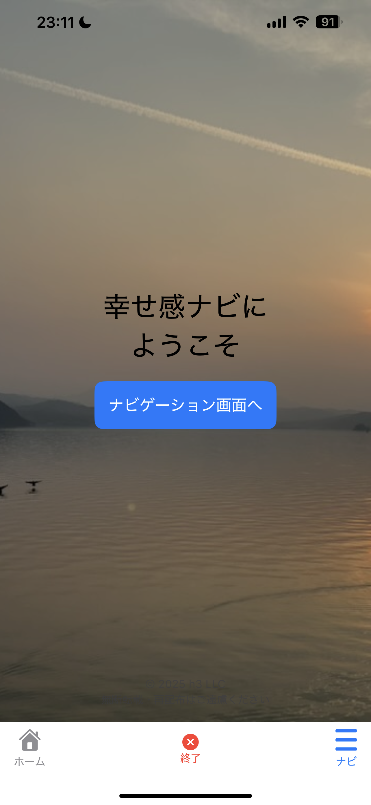
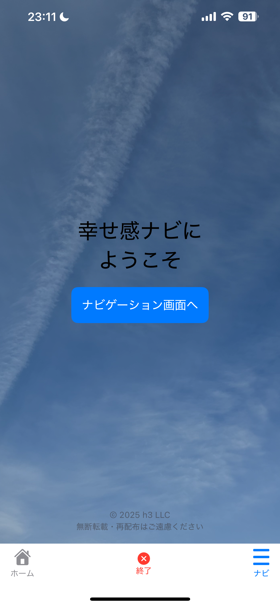
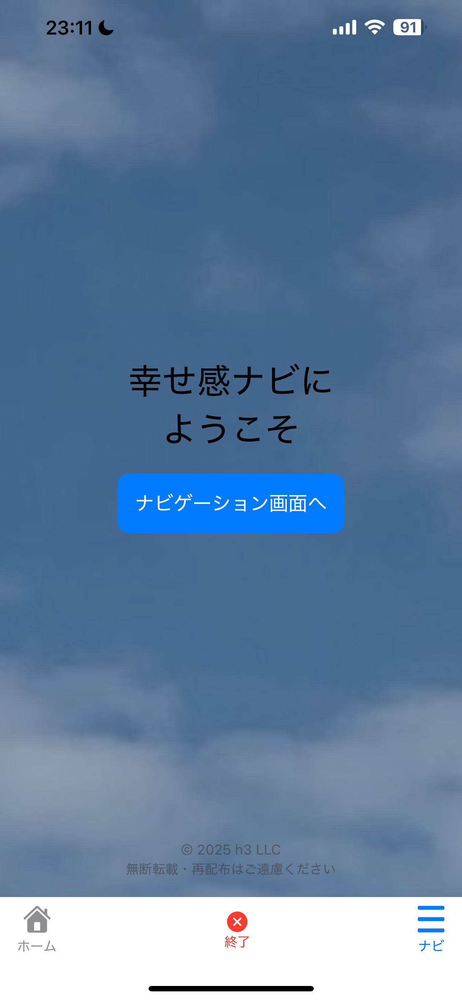

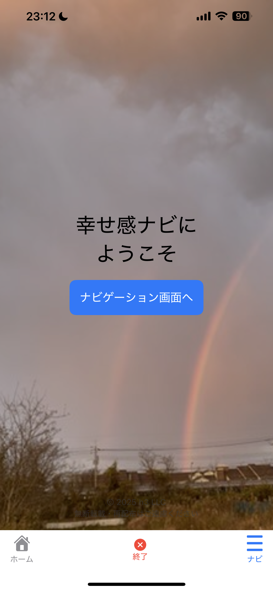

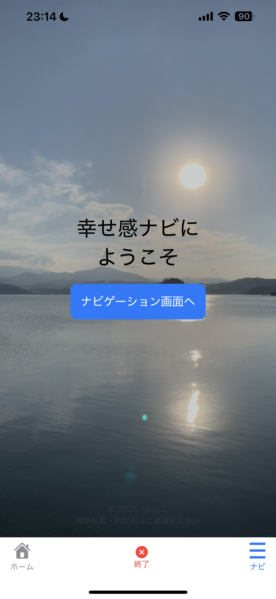

## ナビゲーション画面
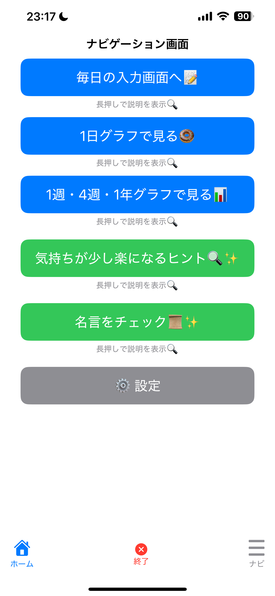

## 手入力画面

## グラフ画面

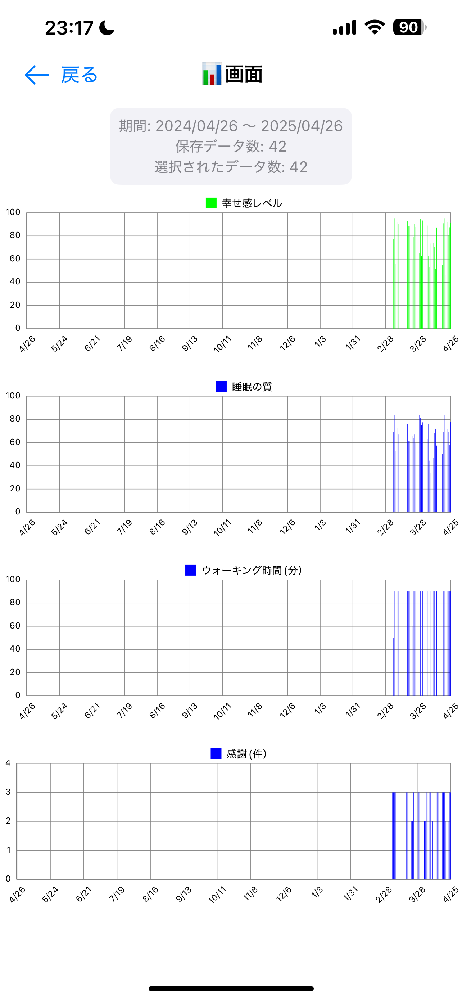

## ヒント画面

## 名言画面
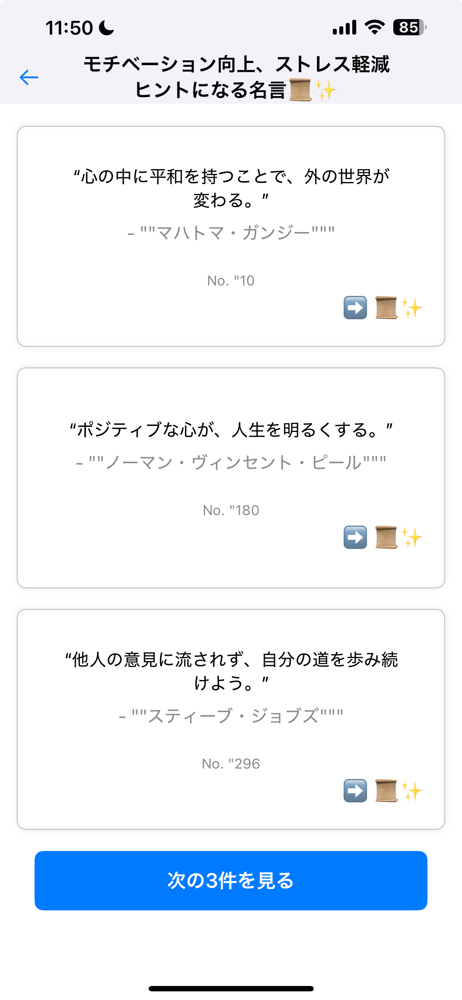

## 設定画面
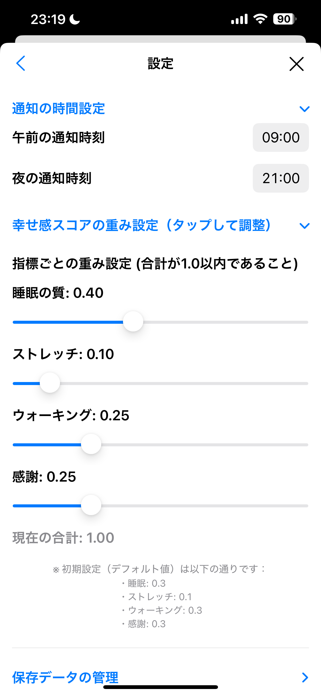
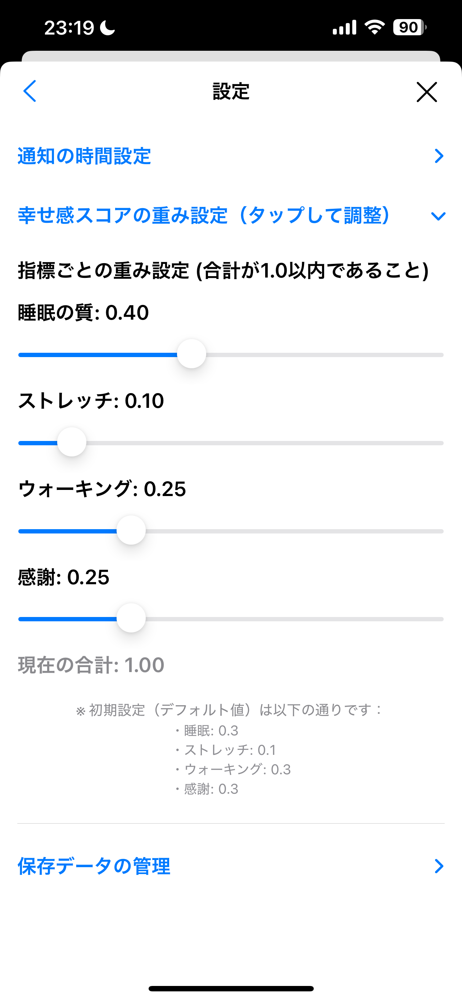
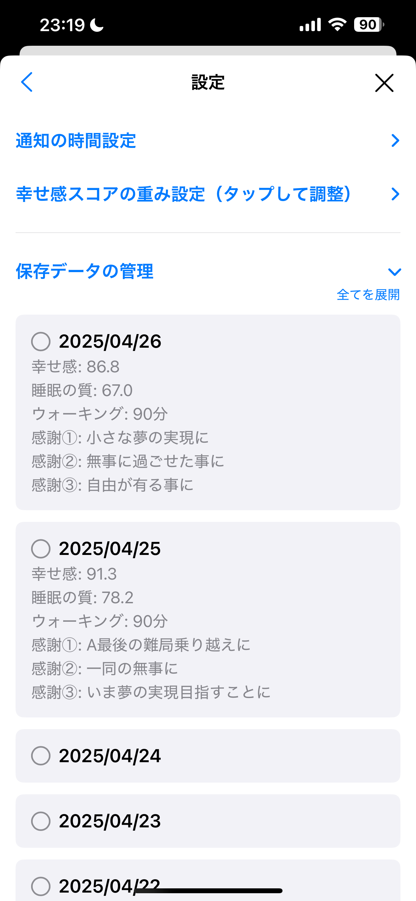
